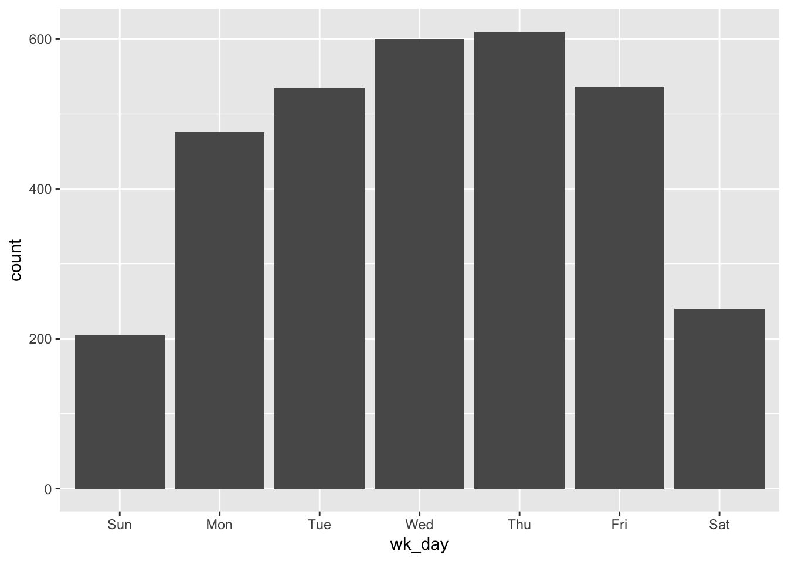

## The goal of this analysis is to understand delays in trains based on tweets from the CTA Twitter handle 


```r
# pull in 3200 recent tweets from CTA handle ------
# commented out to prevent data re-running
#cta_data_1 <- get_timeline(
#  "cta",
#  n = 3200
#) 

# select only relevant columns
#cta_data_1 <- cta_data_1 %>%
#  select(text, created_at, status_id)

# write to CSV to save data
#write.csv(cta_data_1, "cta_tweets_1.csv")

# repeat for continued analysis -- probably run this mid september -----
## second data collection -----------
# commented out until ready for collection
#cta_data_2 <- get_timeline(
#  "cta",
#  n = 3200
#) 

#cta_data_2 <- cta_data_2 %>%
#  select(text, created_at, status_id)

#write.csv(cta_data_1, "cta_tweets_1.csv")

# read in all data collected and combine ----
# commented out until ready for final analysis
cta_data <- read_csv("cta_tweets_1.csv")
```

```
## Warning: Missing column names filled in: 'X1' [1]
```

```
## Parsed with column specification:
## cols(
##   X1 = col_double(),
##   text = col_character(),
##   created_at = col_datetime(format = ""),
##   status_id = col_double()
## )
```

We will be looking at around 2 months of CTA Twitter data (Twitter API only allows 3200 tweets to be pulled at a time) to determine the delays that occurred during the following time period:


```
## [1] "Start date: 2019-06-10"
```

```
## [1] "End Date: 2019-08-01"
```


# Exploratory Data Analysis

## Before pulling out only tweets that contain delay information, it is useful to ask some initial EDA questions

1. How many daily tweets occur in the initial dataset prior to any filtering?

```
##    Min. 1st Qu.  Median    Mean 3rd Qu.    Max. 
##    5.00   35.00   66.00   60.38   79.00  112.00
```

  We see an average of 57 daily tweets, with a range of 5 to 112. 

2. Is there variation among days of the week for tweet volumes?

<!-- -->

As expected, tweet volumes are higher during the work week, when there are likely more trains and passengers, and also likely more delays.

3. What does a single tweet about a delay look like?

```r
cta_data$text[[1]]
```

```
## [1] "[Major Delays] 95th-bound Red Line trains are running w/residual delays &amp; congestion following an earlier mech. problem on a train at Howard. Serv resuming, allow extra time."
```

If the tweet relates to delays, we see that mentioned at the beginning within the brackets. We also see that the train line color is mentioned in the text, which will be useful for determining which train line is delayed.

4. What about tweets we need to filter out?

```r
cta_data$text[[16]]
```

```
## [1] "@pejohnson2 No worries, if you catch it next time please let us know. We’ll still share the info you were able to provide with Customer Service."
```

This is an example of a tweet that does not refer to train delays, and should not be included in our analysis.
