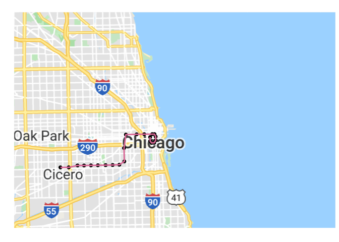
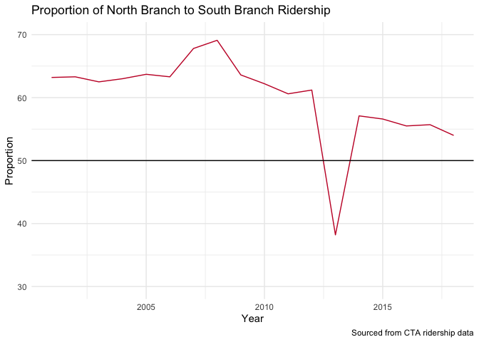
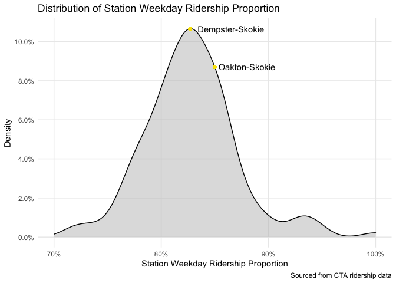

## Description

This R Markdown document uses the publically available CTA Data to analyze different trends through the ridership data. Each individual line for the CTA was looked at, as well as overall trends, to give insight into different facets of CTA ridership throughout the years.

The data used is from two sources, and can be accessed at the following links:

Ridership Data: https://data.cityofchicago.org/Transportation/CTA-Ridership-L-Station-Entries-Daily-Totals/5neh-572f

Station Data: https://data.cityofchicago.org/Transportation/CTA-System-Information-List-of-L-Stops/8pix-ypme 


#### Data Sources
<table class="table" style="margin-left: auto; margin-right: auto;">
 <thead>
  <tr>
   <th style="text-align:right;"> station_id </th>
   <th style="text-align:left;"> stationname </th>
   <th style="text-align:left;"> date </th>
   <th style="text-align:left;"> daytype </th>
   <th style="text-align:right;"> rides </th>
  </tr>
 </thead>
<tbody>
  <tr>
   <td style="text-align:right;"> 40850 </td>
   <td style="text-align:left;"> Library </td>
   <td style="text-align:left;"> 10/09/2004 </td>
   <td style="text-align:left;"> A </td>
   <td style="text-align:right;"> 1057 </td>
  </tr>
  <tr>
   <td style="text-align:right;"> 40780 </td>
   <td style="text-align:left;"> Central Park </td>
   <td style="text-align:left;"> 06/18/2010 </td>
   <td style="text-align:left;"> W </td>
   <td style="text-align:right;"> 1154 </td>
  </tr>
  <tr>
   <td style="text-align:right;"> 41500 </td>
   <td style="text-align:left;"> Montrose-Brown </td>
   <td style="text-align:left;"> 10/30/2001 </td>
   <td style="text-align:left;"> W </td>
   <td style="text-align:right;"> 2116 </td>
  </tr>
  <tr>
   <td style="text-align:right;"> 40500 </td>
   <td style="text-align:left;"> Washington/State </td>
   <td style="text-align:left;"> 10/26/2006 </td>
   <td style="text-align:left;"> W </td>
   <td style="text-align:right;"> 0 </td>
  </tr>
  <tr>
   <td style="text-align:right;"> 41090 </td>
   <td style="text-align:left;"> Monroe/State </td>
   <td style="text-align:left;"> 07/07/2010 </td>
   <td style="text-align:left;"> W </td>
   <td style="text-align:right;"> 9431 </td>
  </tr>
  <tr>
   <td style="text-align:right;"> 40080 </td>
   <td style="text-align:left;"> Sheridan </td>
   <td style="text-align:left;"> 05/29/2009 </td>
   <td style="text-align:left;"> W </td>
   <td style="text-align:right;"> 5601 </td>
  </tr>
</tbody>
</table>

<table class="table" style="margin-left: auto; margin-right: auto;">
 <thead>
  <tr>
   <th style="text-align:right;"> STOP_ID </th>
   <th style="text-align:left;"> DIRECTION_ID </th>
   <th style="text-align:left;"> STOP_NAME </th>
   <th style="text-align:left;"> STATION_NAME </th>
   <th style="text-align:left;"> STATION_DESCRIPTIVE_NAME </th>
   <th style="text-align:right;"> MAP_ID </th>
   <th style="text-align:left;"> ADA </th>
   <th style="text-align:left;"> RED </th>
   <th style="text-align:left;"> BLUE </th>
   <th style="text-align:left;"> G </th>
   <th style="text-align:left;"> BRN </th>
   <th style="text-align:left;"> P </th>
   <th style="text-align:left;"> Pexp </th>
   <th style="text-align:left;"> Y </th>
   <th style="text-align:left;"> Pnk </th>
   <th style="text-align:left;"> O </th>
   <th style="text-align:left;"> Location </th>
  </tr>
 </thead>
<tbody>
  <tr>
   <td style="text-align:right;"> 30162 </td>
   <td style="text-align:left;"> W </td>
   <td style="text-align:left;"> 18th (54th/Cermak-bound) </td>
   <td style="text-align:left;"> 18th </td>
   <td style="text-align:left;"> 18th (Pink Line) </td>
   <td style="text-align:right;"> 40830 </td>
   <td style="text-align:left;"> TRUE </td>
   <td style="text-align:left;"> FALSE </td>
   <td style="text-align:left;"> FALSE </td>
   <td style="text-align:left;"> FALSE </td>
   <td style="text-align:left;"> FALSE </td>
   <td style="text-align:left;"> FALSE </td>
   <td style="text-align:left;"> FALSE </td>
   <td style="text-align:left;"> FALSE </td>
   <td style="text-align:left;"> TRUE </td>
   <td style="text-align:left;"> FALSE </td>
   <td style="text-align:left;"> (41.857908, -87.669147) </td>
  </tr>
  <tr>
   <td style="text-align:right;"> 30161 </td>
   <td style="text-align:left;"> E </td>
   <td style="text-align:left;"> 18th (Loop-bound) </td>
   <td style="text-align:left;"> 18th </td>
   <td style="text-align:left;"> 18th (Pink Line) </td>
   <td style="text-align:right;"> 40830 </td>
   <td style="text-align:left;"> TRUE </td>
   <td style="text-align:left;"> FALSE </td>
   <td style="text-align:left;"> FALSE </td>
   <td style="text-align:left;"> FALSE </td>
   <td style="text-align:left;"> FALSE </td>
   <td style="text-align:left;"> FALSE </td>
   <td style="text-align:left;"> FALSE </td>
   <td style="text-align:left;"> FALSE </td>
   <td style="text-align:left;"> TRUE </td>
   <td style="text-align:left;"> FALSE </td>
   <td style="text-align:left;"> (41.857908, -87.669147) </td>
  </tr>
  <tr>
   <td style="text-align:right;"> 30022 </td>
   <td style="text-align:left;"> N </td>
   <td style="text-align:left;"> 35th/Archer (Loop-bound) </td>
   <td style="text-align:left;"> 35th/Archer </td>
   <td style="text-align:left;"> 35th/Archer (Orange Line) </td>
   <td style="text-align:right;"> 40120 </td>
   <td style="text-align:left;"> TRUE </td>
   <td style="text-align:left;"> FALSE </td>
   <td style="text-align:left;"> FALSE </td>
   <td style="text-align:left;"> FALSE </td>
   <td style="text-align:left;"> FALSE </td>
   <td style="text-align:left;"> FALSE </td>
   <td style="text-align:left;"> FALSE </td>
   <td style="text-align:left;"> FALSE </td>
   <td style="text-align:left;"> FALSE </td>
   <td style="text-align:left;"> TRUE </td>
   <td style="text-align:left;"> (41.829353, -87.680622) </td>
  </tr>
  <tr>
   <td style="text-align:right;"> 30023 </td>
   <td style="text-align:left;"> S </td>
   <td style="text-align:left;"> 35th/Archer (Midway-bound) </td>
   <td style="text-align:left;"> 35th/Archer </td>
   <td style="text-align:left;"> 35th/Archer (Orange Line) </td>
   <td style="text-align:right;"> 40120 </td>
   <td style="text-align:left;"> TRUE </td>
   <td style="text-align:left;"> FALSE </td>
   <td style="text-align:left;"> FALSE </td>
   <td style="text-align:left;"> FALSE </td>
   <td style="text-align:left;"> FALSE </td>
   <td style="text-align:left;"> FALSE </td>
   <td style="text-align:left;"> FALSE </td>
   <td style="text-align:left;"> FALSE </td>
   <td style="text-align:left;"> FALSE </td>
   <td style="text-align:left;"> TRUE </td>
   <td style="text-align:left;"> (41.829353, -87.680622) </td>
  </tr>
  <tr>
   <td style="text-align:right;"> 30214 </td>
   <td style="text-align:left;"> S </td>
   <td style="text-align:left;"> 35-Bronzeville-IIT (63rd-bound) </td>
   <td style="text-align:left;"> 35th-Bronzeville-IIT </td>
   <td style="text-align:left;"> 35th-Bronzeville-IIT (Green Line) </td>
   <td style="text-align:right;"> 41120 </td>
   <td style="text-align:left;"> TRUE </td>
   <td style="text-align:left;"> FALSE </td>
   <td style="text-align:left;"> FALSE </td>
   <td style="text-align:left;"> TRUE </td>
   <td style="text-align:left;"> FALSE </td>
   <td style="text-align:left;"> FALSE </td>
   <td style="text-align:left;"> FALSE </td>
   <td style="text-align:left;"> FALSE </td>
   <td style="text-align:left;"> FALSE </td>
   <td style="text-align:left;"> FALSE </td>
   <td style="text-align:left;"> (41.831677, -87.625826) </td>
  </tr>
  <tr>
   <td style="text-align:right;"> 30213 </td>
   <td style="text-align:left;"> N </td>
   <td style="text-align:left;"> 35-Bronzeville-IIT (Harlem-bound) </td>
   <td style="text-align:left;"> 35th-Bronzeville-IIT </td>
   <td style="text-align:left;"> 35th-Bronzeville-IIT (Green Line) </td>
   <td style="text-align:right;"> 41120 </td>
   <td style="text-align:left;"> TRUE </td>
   <td style="text-align:left;"> FALSE </td>
   <td style="text-align:left;"> FALSE </td>
   <td style="text-align:left;"> TRUE </td>
   <td style="text-align:left;"> FALSE </td>
   <td style="text-align:left;"> FALSE </td>
   <td style="text-align:left;"> FALSE </td>
   <td style="text-align:left;"> FALSE </td>
   <td style="text-align:left;"> FALSE </td>
   <td style="text-align:left;"> FALSE </td>
   <td style="text-align:left;"> (41.831677, -87.625826) </td>
  </tr>
</tbody>
</table>

The data from the CTA involves two sources. The first one includes daily ride totals for each station. The other includes goelocation information about each stop.

Both need some pre-processing before moving on to any analysis. For the ride data, a dataset for each line containing only relevant stops was created. Additionally, a dataset for yearly and monthly rides grouped by station name and day type (Weekend, Saturday, Sunday/Holiday) was created for future analysis. For the stop data, the coordinate locations feature was split into separate latitude and longitude variables for mapping. 


### Entire 'L' System Map

Before analyzing the data, we can use the coordinates provided in the stations dataset to plot a map of all the El lines. 

<!-- -->

As the stations in the loop are close together and difficult to see, the zoomed in map provides greater clarity. Some of the lines in the image below are inaccurate due to plotting straight lines between points - the map should rather be used to identify where loop stations are. 

<!-- -->

Before diving into each line, we should also look at the total yearly ridership for each line. From this chart, we see that the Red and Blue lines are clearly the most popular CTA lines. They also are the only two lines that operate 24/7. We also see an overall growth trend, although in the last couple years it has tapered off for the more popular lines. 

Note: for stations with multiple El lines, the number of rides at that station was equally divided up for each line. Belmont, for example, is served by the Red, Purple Line Express, and Brown Lines, and ridership totals for this station were evenly attributed to each line. As we have no way of knowing the exact proportions of passengers for each station with multiple lines, this was the fairest way to deal with multi-line stations.

<!-- -->

## Deeper Look into Individual Lines 

This section will go more in depth about each of the CTA lines, and any unique characteristics or findings that each may have. 

### Purple Express 

<!-- -->

The purple line express runs on weekdays during the rush hour period, and serves two functions:

* Taking commuters from Evanston down into the city (and the reverse for Northwestern students)
* Providing additional capacity on brown line stations from Belmont to the Loop

As stations don't break out ridership by line for stations with multiple lines, it would be hard to identify anybody who specifically took the purple line express after getting on at Howard. Instead, can we find out how many riders, on average, use the Purple Line express to commute down into the city from Evanston?

We can't measure this exactly, as we don't know where each rider exited, but we can provide an estimate using some assumptions:
 * 75% of trips entering on an Evanston stop during the weekday are taking the train into the city, or Northwestern students returning to the city
 * Rides are filtered to only occur during the Purple Line Express hours of operation 

<!-- -->

The chart above shows the monthly Purple Line Express volumes for Evanston stations. Assuming that 75% of these rides fit the commuter criteria specified above, we can assume that approximately 1000 commuter rides are taken utilizing the purple line express each month. 

We can also check to see if this has been increasing or decreasing for each year. 

<!-- -->

As we can see from the chart above, there hasn't been any major shifts in purple line express volume over the years. Most years are close to the average value, and the trend is pretty similar to overall CTA ridership

### Orange Line 

<!-- -->

The terminus of the Orange Line is at Chicago's Midway Airport, providing passengers arriving with a quick option to get into the Loop. Since 2000, air traffic has grown at Midway due to an increased focus from Southwest Airlines. Has the number of passengers using the train from the Midway stop increased as well?

We can start by first taking a look at the annual passenger traffic and CTA rides at Midway. 

<!-- -->

The chart shows variation in the Airport passenger volume, however due to the relatively small number of CTA rides compared to the large number of airport passengers it is difficult to interpret any trends between the two. 

Midway Airport Traffic Source: https://en.wikipedia.org/wiki/Midway_International_Airport#Airport_traffic

Diving deeper, we can see if the ratio of Airport to CTA traffic has stayed the same. 

<!-- -->

```
## <ScaleContinuousPosition>
##  Range:  
##  Limits: 2e+03 -- 2.02e+03
```

The chart above shows us that the overall ratio of CTA riders to Airport traffic has not seen a lot of variation -- between 2001 and 2018 it has stayed between 14 and 16. This means that there are approximately 14 to 16 airline passengers for every 1 CTA trip. However, after 2010 we see a consistent decline in the ratio for each year. This is driven by the constant increase in airport traffic in these years, while the number of CTA riders has stayed relatively constant. 

Finally, another way to compare the two is to look at the year-over-year growth in volume. The chart below details the growth comparisons, allowing us to analyze relative volume shifts in both yearly numbers. We can see that the lines generally move together -- with any increase or decrease in Airport traffic growth, there is a following increase or decrease in CTA traffic growth. 

<!-- -->

In summary, we can see that the CTA Ridership at the Midway Airport station is related to the Airport Traffic -- however the large increase in Airport Traffic since 2010 hasn't fully transferred over to such a large increase in CTA ridership. 


### Pink Line

<!-- -->

The pink line stretches west and slightly south from the Chicago loop. One of the newest lines, the Pink line began operation on what was a former blue line branch, and stretches west with both Green and Blue line branches. The Pink, Green and Blue line branches stretching west follow such a similar pattern that they share four of the same station names based on streets. Using the station coordinates, we can find out how close each of these stations are to each other.


```
## [1] "Green To Pink Line: Station: Clinton, Distance: 0 Miles"
## [1] "Green To Pink Line: Station: Kedzie, Distance: 1.96 Miles"
## [1] "Green To Pink Line: Station: Pulaski, Distance: 2.04 Miles"
## [1] "Green To Pink Line: Station: Cicero, Distance: 2.24 Miles"
```

```
## [1] "Pink To Blue Line: Station: Clinton, Distance: 0.65 Miles"
## [1] "Pink To Blue Line: Station: Kedzie, Distance: 1.31 Miles"
## [1] "Pink To Blue Line: Station: Pulaski, Distance: 1.29 Miles"
## [1] "Pink To Blue Line: Station: Cicero, Distance: 1.27 Miles"
```

```
## [1] "Green To Blue Line: Station: Clinton, Distance: 0.65 Miles"
## [1] "Green To Blue Line: Station: Kedzie, Distance: 0.64 Miles"
## [1] "Green To Blue Line: Station: Pulaski, Distance: 0.75 Miles"
## [1] "Green To Blue Line: Station: Cicero, Distance: 0.96 Miles"
```

The pink line is approximately 1.5 miles away from the green line stations, and approximately 2 miles away from the blue line stations. Given that the routes are so similar, and are slightly offset north/south from each other, is there a line that is more popular for each of these similarly named stations?

<!-- -->

For the Clinton station, the Green and Pink lines share the station, so rides were grouped into a separate category for both for comparison. Unfortunately for the Pink line, it seems it has been the least popular option to reach the western parts of Chicago, at least for these 4 stations. 

#### Green Line

<!-- -->

One of the first charts made was the annual ridership by line. In there we see a large drop in ridership in 2013 on the Red Line. During this time, the southern part of the Red line was completely shut down for 5 months while the tracks were reubilt. We also see during this time a spike in ridership for the Green Line. Can we estimate how many of the riders impacted by the Red Line shutdown during this time were picked up by Green Line service?

<!-- -->


First, we need to estimate how many riders there would have been in 2013 for each line without any shutdown to service. To do so, we can average the year prior and the year after.


```
## [1] "Green Line 2013 Estimated Riders: 17657791"
```

```
## [1] "Green Line 2013 Actual Riders: 18144334"
```

```
## [1] "Additional Green Line Riders in 2013: 486543"
```

```
## [1] "Red Line 2013 Estimated Riders: 41848319"
```

```
## [1] "Red Line 2013 Actual Riders: 36689718"
```

```
## [1] "Decrease In Red Line Riders in 2013: -5158601"
```

```
## [1] "Difference Between Red Line Loss and Green Line Gain: -4672058"
```

From the numbers above, we see that the Green Line gained close to 500,000 additional rides in 2013 than expected, likely due to the red line shutdown. While this seems like a lot, it actually only makes up about 10% of the Red line ridership lost due to track construction. The rest of the trips were made up in modes of transportation that aren't captured in this data - through shuttle buses, personal transport, or other bus lines.

#### Red Line

<!-- -->

The Red Line stretches from the north border of Chicago all the way down to 95th street, cutting through the heart of the Loop in the middle. As shown in the chart below, the Red Line sees by far and away the most passenger volume. 

<!-- -->

This shouldn't come as a surprise when analyzing the stops near points of interest along the Red Line

 * Addison (Wrigley Field)
 * Sox - 35th Street (Chicago White Sox)
 * Roosevelt (Soldier Field)
 
In addition to this, the red line cuts through the heart of the loop, stretches north along densely populated residential neighborhoods, stops at the popular Chinatown neighborhood, and is one of two CTA lines to run 24/7.

One thing about the Red Line that stands out about the red line is the abundance of stops on the northern half of the line, compared to the scarcity of stops south of the loop. From the northern terminus of Howard to the last stop north of the loop (Grand), there is a distance of approximately 9.4 miles (sourced from google maps). The trip takes 34 minutes, and there are 17 intermediate stops between Howard and Grand. When we look at the distance from the southern terminus of 95th street to the last stop south of the loop (Roosevelt), there is a similar of distance of approximately 10 miles (sourced from google maps). However, the trip takes 21 minutes by train, and there are only 8 intermediate stops. Can we look at the ridership data to determine if the ridership levels truly justify half the available stations over the same approximate distance? 


```
## `summarise()` has grouped output by 'year'. You can override using the `.groups` argument.
```

<!-- -->

If the south branch of the red line had half as many riders as the north branch, the proportion would be 50% - represented by the black line in the chart above. Instead, we see that the south branch consistently has more than 50%, represented in the red line in the chart. While the South Branch has 50% of the station capacity, it is consistently above that in terms of ridership, averaging around 60%.

<!-- -->


Another way to show this is by looking at yearly riders per station for both the south and north branch. The south branch consistently has more riders per station than the north branch, except for 2013 during construction.

We can also look at the exact distances between stations on the north and south branches using the station GPS coordinates to show differences between the North and South branches.


```
## [1] "Distance between top and bottom of red line south branch: 9.34 miles"
```

```
## [1] "Distance between top and bottom of red line north branch: 8.48 miles"
```

```
## [1] "Average distance between stations on red line south branch: 1.04 miles"
```

```
## [1] "Average distance between stations on red line north branch: 0.45 miles"
```

```
## [1] "Stations: Cermak-Chinatown, Roosevelt, Distance: 0.93 Miles"
## [1] "Stations: Sox-35th, Cermak-Chinatown, Distance: 1.42 Miles"
## [1] "Stations: 47th, Sox-35th, Distance: 1.34 Miles"
## [1] "Stations: Garfield, 47th, Distance: 0.96 Miles"
## [1] "Stations: 63rd, Garfield, Distance: 0.96 Miles"
## [1] "Stations: 69th, 63rd, Distance: 0.82 Miles"
## [1] "Stations: 79th, 69th, Distance: 1.16 Miles"
## [1] "Stations: 87th, 79th, Distance: 0.97 Miles"
## [1] "Stations: 95th/Dan Ryan, 87th, Distance: 0.84 Miles"
```

```
## [1] "Stations: Jarvis, Howard, Distance: 0.27 Miles"
## [1] "Stations: Morse, Jarvis, Distance: 0.51 Miles"
## [1] "Stations: Loyola, Morse, Distance: 0.52 Miles"
## [1] "Stations: Granville, Loyola, Distance: 0.49 Miles"
## [1] "Stations: Thorndale, Granville, Distance: 0.22 Miles"
## [1] "Stations: Bryn Mawr, Thorndale, Distance: 0.44 Miles"
## [1] "Stations: Berwyn, Bryn Mawr, Distance: 0.36 Miles"
## [1] "Stations: Argyle, Berwyn, Distance: 0.29 Miles"
## [1] "Stations: Lawrence, Argyle, Distance: 0.28 Miles"
## [1] "Stations: Wilson, Lawrence, Distance: 0.32 Miles"
## [1] "Stations: Sheridan, Wilson, Distance: 0.69 Miles"
## [1] "Stations: Addison, Sheridan, Distance: 0.41 Miles"
## [1] "Stations: Belmont, Addison, Distance: 0.49 Miles"
## [1] "Stations: Fullerton, Belmont, Distance: 0.95 Miles"
## [1] "Stations: North/Clybourn, Fullerton, Distance: 0.94 Miles"
## [1] "Stations: Clark/Division, North/Clybourn, Distance: 0.96 Miles"
## [1] "Stations: Chicago, Clark/Division, Distance: 0.49 Miles"
## [1] "Stations: Grand, Chicago, Distance: 0.32 Miles"
```

<!-- -->

Looking at the distances between stations, we see that the average distance between stations for the south branch of the red line is double that of the distance between stations for the north branch of the red line. This is what we would expect to see, given that the branches are approximately the same length, but the South branch has half as many stations. Riders on the South branch likely have a larger distance to a station, given that stations are placed approximately 1 mile apart, compared to half a mile on the north branch.

What the ridership data shows is that stations on the south branch of the Red Line do have a large demand of riders, while having less stations per rider than the north branch. We also can see from the locations of the stations that the The CTA and south branch residents would likely benefit from additional stations, as it would decrease the distance to a transit stop for riders. 

#### Blue Line

<!-- -->

The CTA blue line cuts through some of the most in-demand neighborhoods, including Wicker Park and Logan Square. These neighborhoods have become very popular over the last decade or two, leading to an increased volume of CTA Blue Line riders. How does this increase compare relative to other CTA lines throughout the years?

<!-- -->

From 2001 to 2018, the CTA Blue Line saw an average daily ridership increase of approximately 1000 riders. This is approximately double that of other major lines, including the Brown, Pink, Red and Orange lines during this time period. 

Anyone who has tried to get on a Blue Line rush hour train at Clark and Lake in the last few years has certainly felt the effects of this increase in ridership. The trains are normally packed to the brim, and delays are frequent. 


#### Brown Line

<!-- -->

The brown line serves one of the most popular and fastest growing areas in Chicago, north from the loop near the lake, serving neighborhoods such as Lakeview, Lincoln Park and Old Town. The upper half of the brown line also serves highly populated areas, but ones that aren't necessarily as popular or growing as fast. Can we see any differences between the ridership growth in the different halves of the Brown Line?

<!-- -->

 There are two trends emerging with the brown line. For the lower half of the stations outside of the loop, they all have a positive yearly median ridership growth. This also increases with station size, with merchandise mart and addison being the two outliers. For stations on the upper half, the trend is opposite. As the station yearly ridership increases, the median yearly growth decreases. Fullerton and Belmont were omitted from this as they both also have connections to the red line. 
 
 
#### Yellow Line

<!-- -->

The CTA Yellow line serves mainly as a commuter line for Skokie. The yellow line terminates at the Howard station, allowing for transfers to the Red and Purple lines to take down into the city. While this is a very convinient option for many weekday commuters, it means the line mainly goes unused on the weekends. How does this compare to average for weekday/weekend?

<!-- -->

The chart above shows that the two Yellow Line stations are actually both around average in terms of the proportion of total rides that are on weekdays. The Dempster stop is on par with the majority of stops at around 83%, while the Oakton stop is slightly higher at 85%. 

### Aggregated CTA Metrics 
<!-- --><!-- -->

-- Feature Backlog --

### Shiny app 
- filter to time ranges/weekdays, select stations to view and ridership

### Pick out individual stops with large increase/decrease
- tell story for what happened

### Type of Day
- which stops are popular on weekends vs weekday commuter stops, which see largest difference

### Commuter Lines
- what lines are used more than others on weekends/weekdays 

### Addison Stop
- saturdays with game, saturdays without game 
- build a model to predict if there was a game that day 

### Distance to Transit
- for each chicago zip code, take the median coordinate and find the min distance to an L stop. Find the highest population zip codes far away from transit. Look at differences between north, south and west sides.
